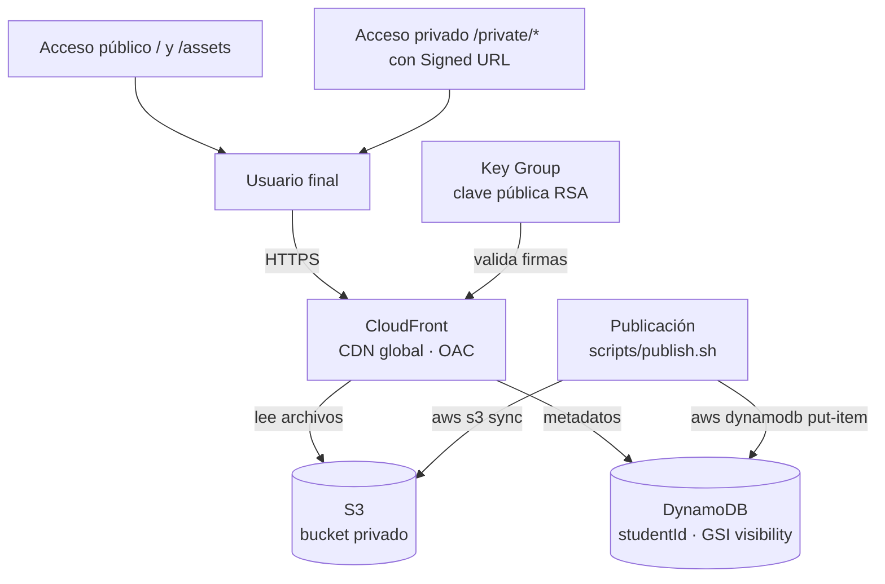

# Arquitectura — Plataforma de Portafolios Estudiantiles

## Componentes

- **Amazon S3** — Almacena los archivos del portafolio (HTML, CSS, imágenes, PDFs). Bucket totalmente privado.
- **Amazon CloudFront** — CDN global. Es el **único** acceso al bucket y valida las Signed URLs de rutas privadas.
- **Amazon DynamoDB** — Guarda los metadatos de cada portafolio (estudiante, fecha, URL, visibilidad).
- **AWS IAM** — Solo CloudFront puede leer el bucket (mínimo privilegio).

## Diagrama de arquitectura



## Preguntas y porqués

- **¿Por qué el bucket es privado (\(BLOCK\_ALL\))?** — La seguridad y el rendimiento se concentran en CloudFront. Si el bucket fuera público, se perdería el control de URLs firmadas, caché y HTTPS.
- **¿Por qué OAC?** — Origin Access Control deja que CloudFront lea el bucket privado firmando cada petición con SigV4, sin credenciales expuestas ni bucket público.
- **¿Por qué `PRICE_CLASS_ALL`?** — El portafolio debe cargar rápido desde cualquier país (Latinoamérica, Europa, Asia). Este plan usa todos los puntos de presencia (PoPs) de CloudFront.
- **¿Por qué DynamoDB On-Demand (`PAY_PER_REQUEST`)?** — La carga es por estudiante y esporádica. Se paga por uso real, sin capacidad provisionada.
- **¿Por qué Signed URLs para `*/private/*`?** — Permite compartir archivos sensibles solo con quien tenga un enlace firmado y vigente, validado por el Key Group.

## Seguridad y acceso

- **S3 no es accesible directamente.** No tiene políticas públicas, ni hosting estático, ni ACLs: cualquier petición directa al bucket responde **403**.
- **CloudFront accede vía OAC.** La única bucket policy permite `s3:GetObject` solo a CloudFront y solo si la petición proviene de esta distribución (condición `AWS:SourceArn`).
- **Mínimo privilegio.** Ningún otro usuario o servicio puede leer el bucket desde el stack.

## Archivos privados

Los archivos bajo `*/private/*` solo se sirven con **Signed URLs** (CloudFront Signed URLs). CloudFront valida la firma contra el **Key Group** (clave pública RSA) antes de responder; el resto del contenido se sirve sin restricción.

## Cómo arrancar el proyecto

**1. Generar las llaves RSA** (el stack lee `cdk/keys/public_key.pem` al compilar):

```bash
openssl genrsa -out private_key.pem 2048
openssl rsa -pubout -in private_key.pem -out public_key.pem
# Mover ambas a cdk/keys/ (los *.pem están en .gitignore y no se suben a git)
```

**2. Desplegar la infraestructura:**

```bash
cd cdk
npx cdk bootstrap   # solo la primera vez
npx cdk deploy      # crea bucket, CloudFront, DynamoDB y deja los Outputs
```

**3. Crear el `.env`** en la raíz con los valores de los `Outputs` de `cdk deploy` y de tu región:

```
BUCKET_NAME=<BucketName>
CLOUDFRONT_DOMAIN=<CloudFrontDomainName>
TABLE_NAME=<TableName>
REGION=<tu-region>
```

**4. Publicar un portafolio:**

```bash
./scripts/publish.sh -i univalle-2026-001 -n "Ana Estudiante" -p "Ingeniería de Sistemas" [-v private] [-d ./application]
```

- `-i`, `-n`, `-p` son obligatorios (id, nombre y programa del estudiante).
- `-v public|private` define la visibilidad en DynamoDB (por defecto `public`).
- `-d` cambia la carpeta de assets (por defecto `./application`).
- El script sube los archivos públicos (y los de `private/` por separado) y registra el portafolio en DynamoDB, previa confirmación `(s/N)`.